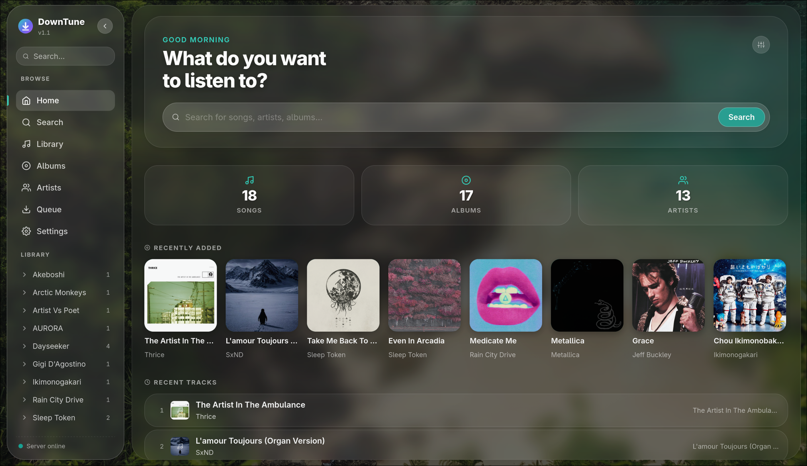
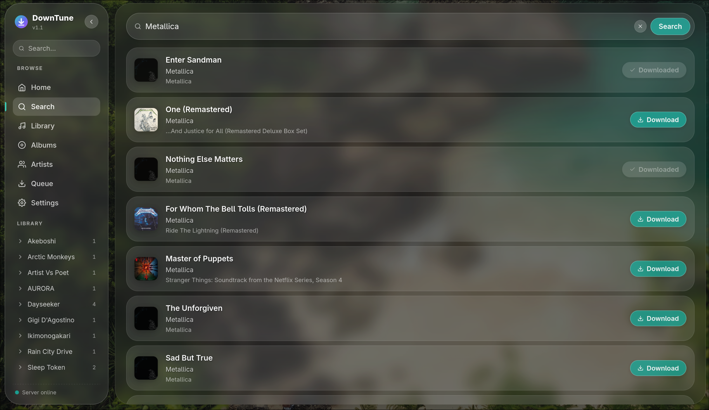
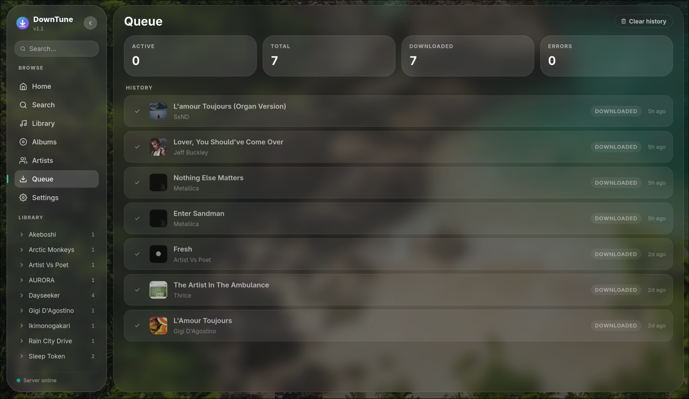
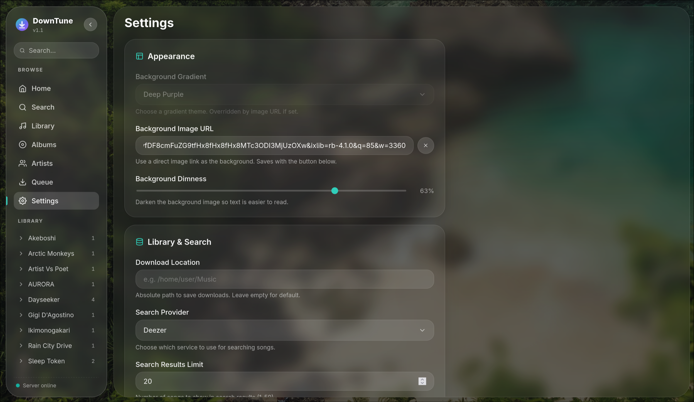

# DownTune
This previously was titled `Spotify Downloader Web Server` however I've decided to change the name as I've overhauled the UI. This is the up-to-date version of [CLI-Spotify-Downloader's Web Server](https://github.com/w1l238/CLI-Spotify-Downloader). Written in [node.js](https://nodejs.org/en) and [vite](vite.dev) instead of python and static HTML/CSS. This application does the same thing as the previous one but with more of an emphasis on user experience and UI/UX.

## Features
This web app features an all in one place to download, manage, and search for music. Using spotify API keys (now paid) or deezer API (free) to search and Youtube (yt-dlp) to download the song and place in a structured folder path (`~/downloads/ARTIST_NAME/ALBUM_NAME/SONG_NAME.mp3`). Along with a UI overhaul which has more options for customization, a new queue feature to track past and current downloads, an artist page to organize by artists downloaded, and more. This web app is great for downloading songs (mp3 format exclusively) on a server to stream or to just rip for personal use.

## UI Screenshots for v1.1 overhaul
### Home Page
The home page has been completely redesigned from the previous one. This features your latest downloads in album and song format. Along with a quick search bar.


### Results Page
The results page isn't much different from the previous one in terms of functionality or design, just some updates on UI.


### New Queue Page
The new queue page has been added for keeping track of past and current downloads. Useful for knowing the status of a download or what you've downloaded previously.


### Settings Page
The settings page is mainly the same but with extra functionality and features. First there is the ability to add a custom background instead of using the featured gradients (using URLs). You can also adjust the dimness of the custom image if things get washed out. There is a new toggle to auto refresh the library upon downloading a new song as well and others too.


### Other Things
There are many other tweaks and additions that have made their way into this new UI. Mess around in the app and you might see some of them!

### Use of LLMs
Yes, this project does use large language models (or AI) for rapid development and git commits, etc. Since this is a sensitive topic in online spaces if you don't want to use it due to this then that's your prerogative. If you still would like to try this out, by all means.


## Setup (Baremetal)

### Option 1
1. Run `npm install` in both the `client` and `server` folders, then running `make dev` (development) or `make run` (production) from the project root to run the web app.

### Option 2
1. Run `./setup.sh` (linux) or `setup.ps1` (windows) which will install all dependencies for both the client and server.
2. Run `make run` (production) or `make dev` (development) from the project root to run the web app. Run `make help` if you need descriptions and a list of commands given.

### Keep in mind
`make dev` and `make run` run on separate ports. In `make dev` the frontend and backend run independently; in `make run` everything is served from the Express backend on a single port.

| | `make dev` | `make run` |
|---|---|---|
| Frontend | http://localhost:5173 | http://localhost:3000 |
| Backend API | http://localhost:3001 | http://localhost:3000/api/* |

### Spotify Setup (Optional)
2. Visit [Spotify's Documentation](https://developer.spotify.com/documentation/web-api) on their web-api and walkthrough the app creation process to obtain your spotify api keys if you so choose. 
3. If you choose Spotify paste those API keys into `server/.env` or alternatively through the web UI in settings (ensure you choose `Spotify` for the provider to unlock the area for api keys).

## Docker
If you want to run it in a docker container edit `docker-compose.yml` to your configuration and run `docker-compose up --build -d` to get it running. You can then proceed with step 2 & 3 if you would like to use spotify. I recommend using the WebUI for the API keys if you are running in docker.

## Continuous Integration

The GitLab pipeline runs frontend and backend linting, a production frontend build, backend unit tests with JUnit and coverage reporting, and Playwright browser smoke tests. Container jobs are manual until the self-hosted runner's Docker-in-Docker configuration has been verified.

The runner must use the Docker executor. Docker-in-Docker jobs require the following settings in the runner's `config.toml`:

```toml
[[runners]]
  executor = "docker"

  [runners.docker]
    image = "docker:27.5.1-cli"
    privileged = true
    volumes = ["/certs/client", "/cache"]
```

Restart GitLab Runner after changing its configuration. Run the manual `docker-runner-check` job first. A successful job must print both client and server versions and run the `hello-world` image. If the self-hosted registry uses an internal certificate authority, install that CA in the runner host, Docker-in-Docker service trust configuration, and production Docker host.

Useful local checks:

```bash
npm run lint
npm run build
npm test
npm run test:e2e

docker build -t downtune-client:ci ./client
docker build -t downtune-server:ci ./server
COMPOSE_PROJECT_NAME=downtune-ci docker compose -f docker-compose.ci.yml up -d --no-build --wait server client
COMPOSE_PROJECT_NAME=downtune-ci docker compose -f docker-compose.ci.yml --profile test run --rm smoke
COMPOSE_PROJECT_NAME=downtune-ci docker compose -f docker-compose.ci.yml down -v
```

### Container publishing

The protected manual `publish-images` job pushes client and server images to the GitLab Container Registry under commit-SHA tags. It exports digest-pinned `CLIENT_IMAGE` and `SERVER_IMAGE` values for deployment. No registry password is stored in the repository; GitLab's job token performs the push.

### Production deployment

Deployment is protected and manual. Configure these GitLab CI/CD variables:

- `DEPLOY_HOST`, `DEPLOY_USER`, and `DEPLOY_PATH`
- `SSH_PRIVATE_KEY` as a protected file variable
- `SSH_KNOWN_HOSTS` as a protected file variable
- `REGISTRY_DEPLOY_USER` and `REGISTRY_DEPLOY_PASSWORD` from a protected deploy token with only `read_registry`
- `PRODUCTION_URL`

Mark credentials as protected and masked where GitLab permits it. Protect the `production` environment in GitLab so only intended operators can start deployment and rollback jobs.

The deployment host must have Docker Compose installed and network access to the self-hosted GitLab Container Registry. Each deployment logs in using the read-only deploy token. The directory identified by `DEPLOY_PATH` must contain:

- `server/.env` with DownTune server settings
- `.env` with `DOWNLOADS_PATH` and optional `APP_PORT`

`deploy-production` copies `docker-compose.prod.yml`, pulls digest-pinned images, starts them with health checks, and verifies the proxied CSRF endpoint. Deployments are serialized through GitLab's `production` resource group.

For rollback, set `ROLLBACK_CLIENT_IMAGE` and `ROLLBACK_SERVER_IMAGE` to previous digest-pinned registry references, then run the protected manual `rollback-production` job.

## Issues
There are some current issues being investigated:

- MacOS certificate verify failing using yt-dlp
